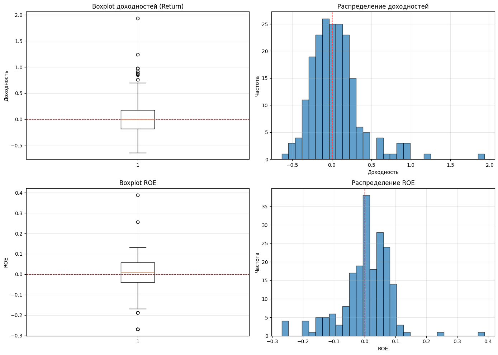
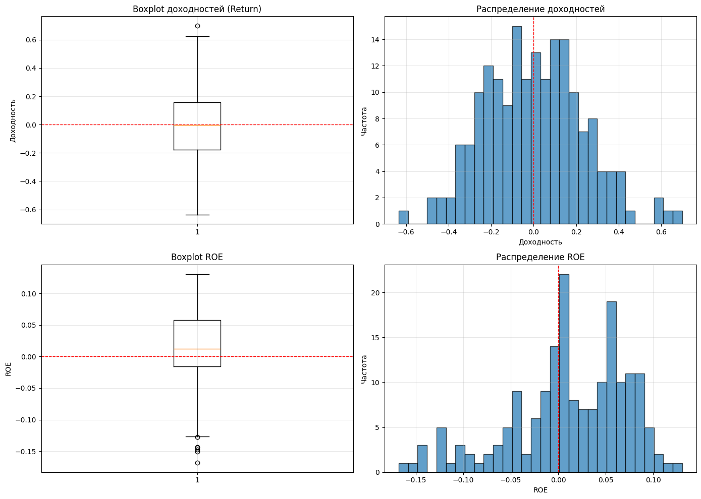
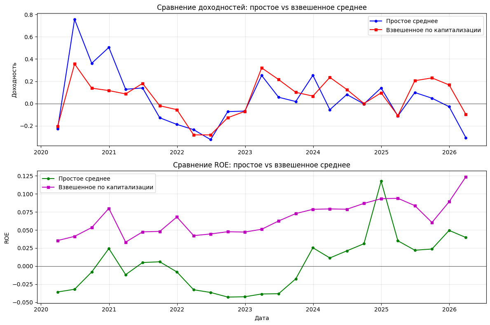

# ROE and Stock Returns Analysis (Fama-MacBeth Approach)

## 1. Data Preparation

### 1.1 ROE Data Cleaning

| Metric | Value |
|--------|-------|
| **Initial companies** | 12 |
| **Final companies (after 25% completeness threshold)** | 8 |
| **Companies removed** | 4 |
| **Analysis period** | 2020-03-31 — 2026-03-31 |
| **Number of quarters** | 25 |
| **Initial missing values in ROE** | 113 |
| **Final missing values** | 0 |

---

### 1.2 Returns Calculation

| Metric | Value |
|--------|-------|
| **Method** | End_Price / Start_Price - 1 |
| **Missing returns** | 0 |

### 1.3 Market Capitalization Data

| Metric | Value |
|--------|-------|
| **Periods (quarters)** | 25 |
| **Companies** | 8 |
| **Missing values** | 0 |

### 1.4 Market Aggregates (Time Series)

For each quarter, we calculate the simple average across all companies:

| Metric | Value |
|--------|-------|
| **Number of periods** | 25 |
| **Number of series** | 4 |
| **Missing values** | 0 |
| **Mean Market Return (avg across periods)** | 0.0439 |
| **Mean ROE (avg across periods)** | 0.0027 |

The cleaned data was merged into a panel dataset (Company × Quarter) and exported to `time_series.xlsx`.

---

## 2. Regression Results

### 2.1 Time Series OLS

Model: `Market_Avg_Return = α + β × Market_Avg_ROE + ε`

| Metric | Value |
|--------|-------|
| **Coefficient (β)** | 0.3810 |
| **t-statistic** | 0.2785 |
| **p-value** | 0.7831 |
| **R-squared** | 0.0034 |
| **Significant (p < 0.05)** | No |

---

### 2.2 PanelOLS (without Time Effects)

Model with company fixed effects: `Returnᵢₜ = αᵢ + β × ROEᵢₜ + εᵢₜ`

| Metric | Value |
|--------|-------|
| **Coefficient (β)** | 0.4365 |
| **t-statistic** | 1.1811 |
| **p-value** | 0.2390 |
| **R-squared** | 0.0069 |
| **Significant (p < 0.05)** | No |

---

### 2.3 PanelOLS (with Time Effects)

Model with company and time fixed effects: `Returnᵢₜ = αᵢ + γₜ + β × ROEᵢₜ + εᵢₜ`

| Metric | Value |
|--------|-------|
| **Coefficient (β)** | 0.467962 |
| **t-statistic** | 1.315036 |
| **p-value** | 0.190301 |
| **R-squared** | 0.011547 |
| **Significant (p < 0.05)** | No |

---

### 2.4 Recent Prices from Yahoo Finance

Daily prices for the last 10 trading days were downloaded for 8 tickers and saved to `recent_10_days_prices.xlsx`.

---

## 3. Outlier Analysis

Outliers were detected using the **IQR (Interquartile Range)** method, where values outside [Q1 - 1.5×IQR, Q3 + 1.5×IQR] are considered outliers.

### 3.1 IQR Summary

| Variable | Q1 | Q3 | IQR | Lower Bound | Upper Bound | Outliers |
|----------|----|----|-----|-------------|-------------|----------|
| Returns | -0.1759 | 0.1788 | 0.3547 | -0.7079 | 0.7108 | 9 (4.5%) |
| ROE | -0.0392 | 0.0569 | 0.0962 | -0.1835 | 0.2012 | 10 (5.0%) |

### 3.2 Visualization

The plots below show boxplots and histograms for both variables, highlighting the distribution and extreme values.



---

### 3.3 Outlier Removal

After identifying outliers using the IQR method, observations outside the bounds were removed:

| Metric | Value |
|--------|-------|
| **Initial observations** | 200 |
| **Outliers removed** | 19 (9.5%) |
| **Final observations** | 181 |

### 3.4 After Removal

The plots below show the data distribution after outlier removal.



---

## 4. Weighting by Market Capitalization

Each company was weighted by its market cap relative to the total market cap for each period:

```
Weightᵢₜ = MarketCapᵢₜ / ΣMarketCapₜ
```

| Metric | Simple Average | Weighted Average |
|--------|----------------|------------------|
| **Mean Return** | 0.0439 | 0.0560 |
| **Mean ROE** | 0.0027 | 0.0657 |



---

## 5. Weighted Regression Results

After weighting by market capitalization, the OLS regression was repeated:

| Metric | Simple OLS | Weighted OLS |
|--------|------------|--------------|
| **Coefficient (β)** | 0.3810 | 0.7344 |
| **t-statistic** | 0.28 | 0.46 |
| **p-value** | 0.783 | 0.651 |
| **R-squared** | 0.003 | 0.009 |
| **Significant** | No | No |

The coefficient increased after weighting, indicating that larger companies have a stronger ROE-return relationship.

---

## 6. Fama-MacBeth Regression

The Fama-MacBeth two-step procedure:
1. Cross-sectional regression for each period: `Returnᵢ = αₜ + βₜ × ROEᵢ + εᵢ`
2. Time-series average of coefficients: `β̄ = (1/T) × Σβₜ`

### 6.1 Full Period Results

| Metric | Value |
|--------|-------|
| **Coefficient (β̄)** | 0.547012 |
| **t-statistic** | 2.274494 |
| **p-value** | 0.032162 |
| **Significant (p < 0.05)** | Yes |
| **Number of periods** | 25 |
| **Average R²** | 0.1755 |

### 6.2 Comparison of All Methods

| Method | Coefficient | p-value | Significant |
|--------|-------------|---------|-------------|
| OLS (Time Series) | 0.3810 | 0.783 | No |
| PanelOLS (no time) | 0.4365 | 0.239 | No |
| PanelOLS (with time) | 0.4680 | 0.190 | No |
| Weighted OLS | 0.7344 | 0.651 | No |
| **Fama-MacBeth** | **0.5470** | **0.032** | **Yes** |

**Key Observations:**

- Only the **Fama-MacBeth** method shows a statistically significant relationship (p < 0.05)
- The coefficient from Fama-MacBeth (β = 0.5470) is higher than simple OLS (β = 0.3810)
- PanelOLS with time effects gives slightly higher coefficient than without time effects
- Weighting by market capitalization increased the coefficient but did not improve significance

**Why Fama-MacBeth differs from PanelOLS?**

| Aspect | PanelOLS | Fama-MacBeth |
|--------|----------|--------------|
| Coefficient | Single β for all periods | Average of period-specific βₜ |
| Period weighting | Periods with higher variance get more weight | Each period gets equal weight |
| Standard errors | Based on pooled data (clustered) | Based on time-series variation of βₜ |

---

### 6.3 COVID-19 Period (2020-2021)

| Metric | Value |
|--------|-------|
| **Coefficient (β̄)** | 0.068882 |
| **t-statistic** | 0.175223 |
| **p-value** | 0.865865 |
| **Significant (p < 0.05)** | No |
| **Number of periods** | 8 |
| **Average R²** | 0.1184 |

### 6.4 Comparison: Full Period vs COVID Period

| Period | Coefficient | p-value | Significant |
|--------|-------------|---------|-------------|
| Full Period | 0.5470 | 0.032 | Yes |
| COVID-19 | 0.0689 | 0.866 | No |

The relationship between ROE and stock returns weakened during the COVID-19 pandemic.

**Possible reasons for COVID-19 period results:**

- Market irrationality and panic selling during the pandemic
- Government stimulus programs distorting normal market mechanisms
- High volatility making it difficult to detect fundamental relationships
- Limited number of observations (only 8 quarters)

---

